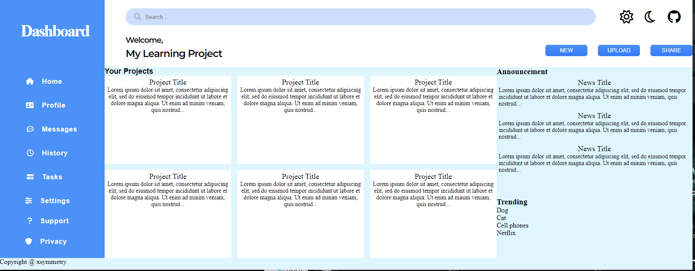
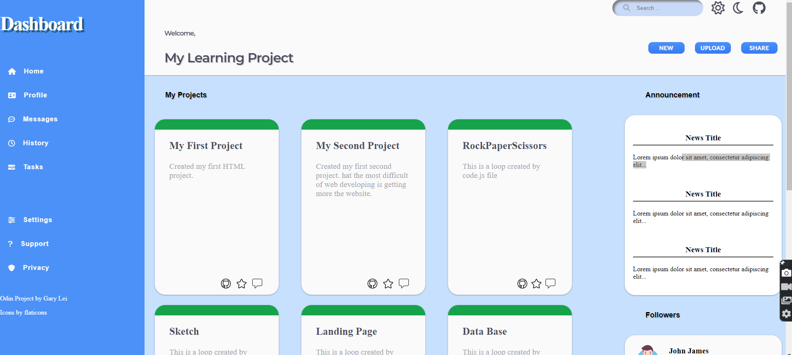

# Admin Dashboard project from Odin Projects

## Live Website 
https://xsymmetry9.github.io/Admin-Dashboard/

Instruction: Create an Admin Dashboard that looks similar to the following.

## Websites used for this website

- Used fontawesome https://fontawesome.com/v4/

- Used https://getcssscan.com/css-box-shadow-examples by CSS Scan for box shadows

- https://www.flaticon.com/authors/aldo-cervantes

## My Updates

